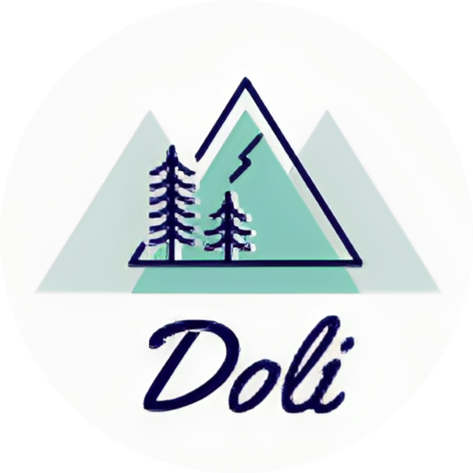

<h1 align="center">EthanLi's CyberGlow Theme</h1>

<samp>&nbsp;&nbsp;&nbsp;&nbsp;&nbsp;&nbsp;&nbsp;Font | <a href="https://input.djr.com/">Input Mono</a> 
&nbsp;File Icons | <a href="https://marketplace.visualstudio.com/items?itemName=Catppuccin.catppuccin-vsc-icons">Catppuccin</a> 
Product Icons | <a href="https://github.com/antfu/vscode-icons-carbon">Carbon</a>&nbsp;&nbsp;&nbsp;&nbsp;&nbsp;&nbsp; 
&nbsp;&nbsp;&nbsp;&nbsp;&nbsp;&nbsp;&nbsp;&nbsp;&nbsp;&nbsp;&nbsp;&nbsp;&nbsp;&nbsp;&nbsp;&nbsp;</samp>

## Thanks
This project is based on [vscode-theme-vitesse](https://github.com/antfu/vscode-theme-vitesse).
