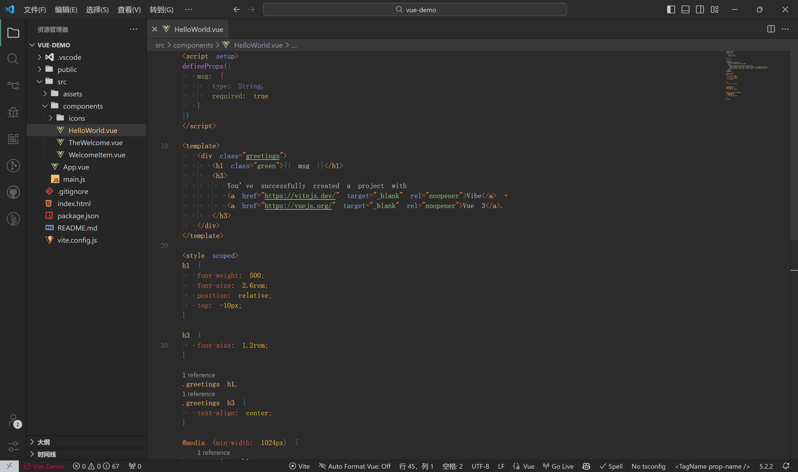
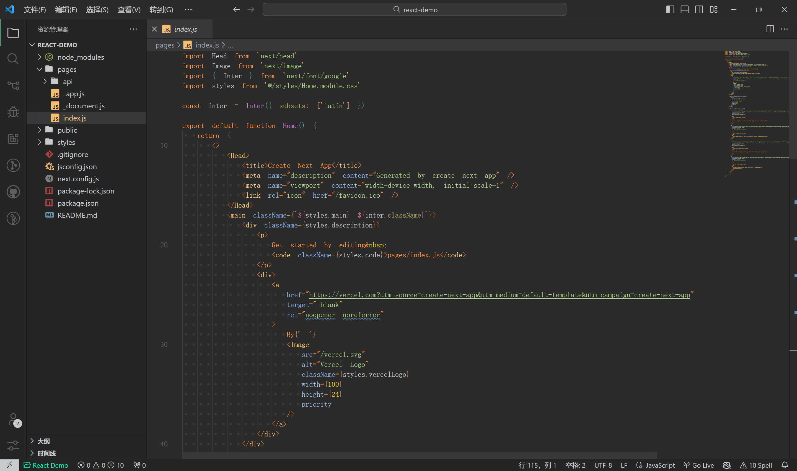
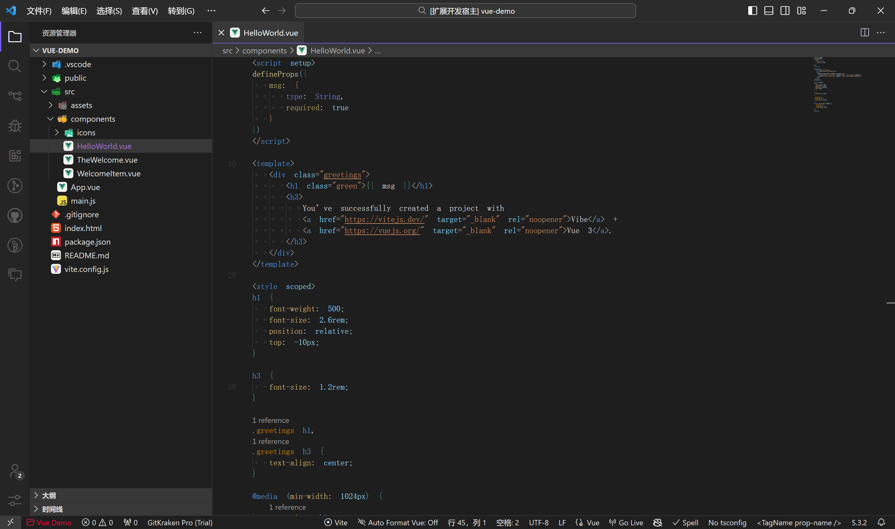
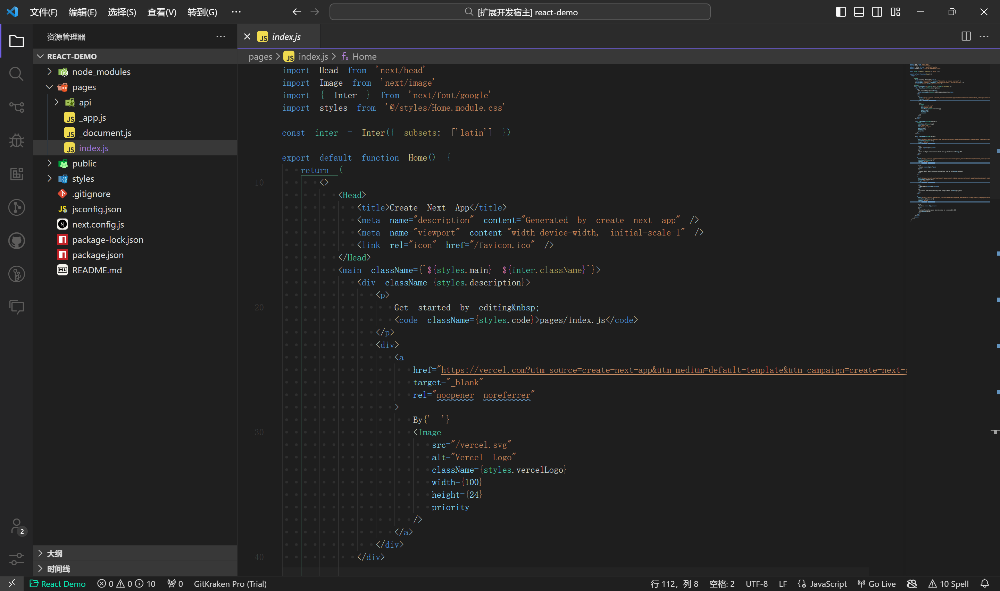
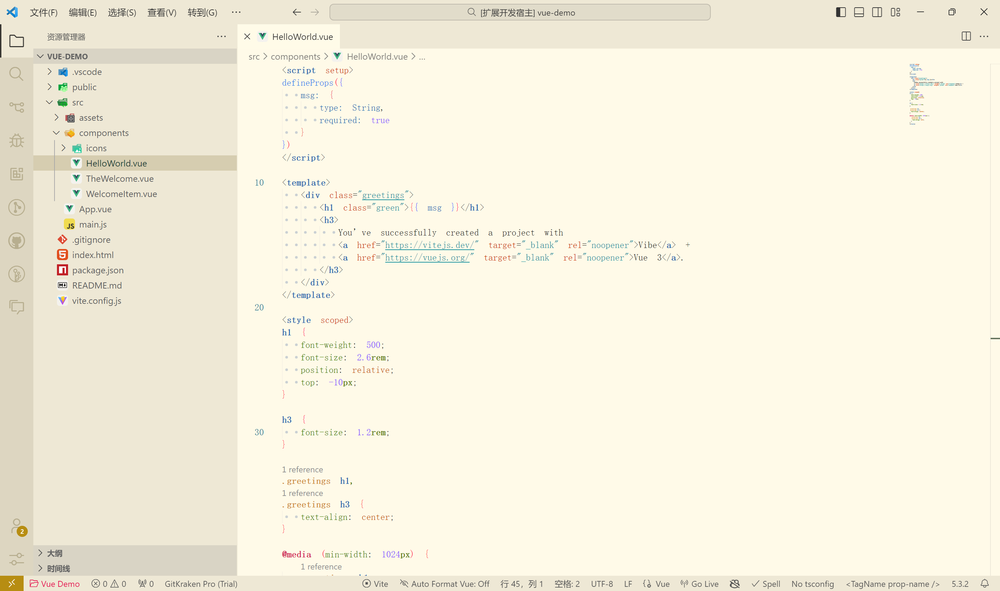

<h1 align="center">Doli Theme for VS Code</h1>

<h3 align="center">Universal</h3>

|Vue|React|
|--|--|
|||

<h3 align="center">Visual Studio</h3>

|Vue|React|
|--|--|
|||

<h3 align="center">Soft Green</h3>

|Vue|React|
|--|--|
|||

## Thanks

[vscode-theme-vitesse](https://github.com/antfu/vscode-theme-vitesse) · [soft-green](https://github.com/lainbo/soft-green)
